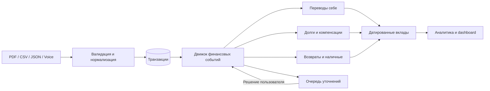
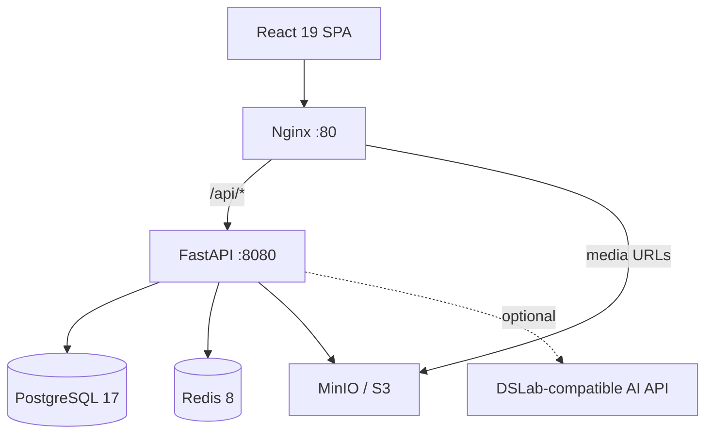

<div align="center">

# PALATA

### Финансы, которые показывают не банковский оборот, а ваши реальные расходы

[](https://react.dev/)
[](https://fastapi.tiangolo.com/)
[](https://www.postgresql.org/)
[](https://docs.docker.com/compose/)
[](LICENSE)

PALATA объединяет банковские операции в понятные финансовые события, исключает переводы между своими счетами, связывает возвраты и компенсации, а вопросы задаёт только там, где без человека действительно нельзя.

[Быстрый старт](#-быстрый-старт) · [Возможности](#-что-умеет-palata) · [Архитектура](#-архитектура) · [API](docs/BACKEND_API.md) · [Дизайн-система](DESIGN.MD)

</div>

---

## Зачем PALATA

Обычное банковское приложение считает каждое списание расходом, а каждое поступление доходом. Из-за этого перевод между своими счетами, возврат долга или компенсация за общий ужин искажают картину.

PALATA собирает транзакции в связанные события и отвечает на главный вопрос: **сколько денег пользователь действительно потратил**.

| Банковская операция | Как считает PALATA |
|---|---|
| Перевод между своими счетами | Не доход и не расход |
| Покупка на 8 000 ₽ и четыре компенсации | Личный расход — 1 600 ₽ |
| Выданный и возвращённый долг | Не влияет на доходы и расходы |
| Возврат товара | Уменьшает расход в дату возврата |
| Снятие наличных | Перевод в наличный кошелёк |
| Неизвестное поступление | Не считается доходом до подтверждения |

## ✨ Что умеет PALATA

- **Импортировать банковскую выписку** — PDF Т‑Банка, извлечённый UTF‑8 текст, JSON или CSV.
- **Проверять выписку до записи** — суммы строк сверяются с итогами банка; неполный или повреждённый файл не попадёт в базу.
- **Считать реальные траты** — переводы, долги, возвраты, общие покупки и наличные не ломают аналитику.
- **Показывать граф денег** — у события видны исходное списание, связанные поступления, возвраты и компенсации.
- **Разбирать неоднозначные операции в один тап** — PALATA предлагает только допустимые действия и подходящие события.
- **Строить аналитику по периоду** — день, неделя, месяц, год или произвольный диапазон с категориями и сравнением.
- **Импортировать покупки маркетплейсов** — Ozon, Wildberries и Яндекс Маркет через нормализованный контракт без двойного учёта расходов.
- **Принимать расходы голосом** — аудио превращается в подтверждаемый черновик и может быть связано с банковской операцией.
- **Давать AI-инсайты безопасно** — модели передаются только рассчитанные агрегаты, без ФИО, реквизитов и текстов транзакций.
- **Работать mobile-first** — быстрый интерфейс в стилистике банковского приложения с единым периодом на всех экранах.

> Банковские подключения в текущем MVP работают в демо-режиме. Реальный пользовательский сценарий — файловый импорт выписки. Marketplace-интеграции принимают экспортированные данные покупателя, а не используют seller API.

## 🚀 Быстрый старт

### Требования

- Docker Desktop или Docker Engine с Compose v2
- OpenSSL для первичной генерации JWT-ключей
- свободные порты `80`, `8080`, `5432`, `6379`, `9000` и `9001`

### 1. Подготовьте окружение

```bash
git clone https://github.com/luhgeek1/cu-hack.git
cd cu-hack

cp .env.example .env
cp backend/.env.example backend/.env

mkdir -p backend/secrets
openssl genpkey -algorithm RSA -pkeyopt rsa_keygen_bits:2048 \
  -out backend/secrets/jwt_private_key.pem
openssl rsa -pubout \
  -in backend/secrets/jwt_private_key.pem \
  -out backend/secrets/jwt_public_key.pem
```

Файлы `.env` и `backend/secrets/` исключены из Git. Значения из примеров предназначены только для локальной разработки — замените их перед публичным развёртыванием.

### 2. Поднимите весь стек

```bash
docker compose up -d --build
```

Или короткой командой:

```bash
make up
```

Миграции Alembic выполнятся автоматически перед запуском API.

### 3. Откройте приложение

| Сервис | Адрес |
|---|---|
| PALATA | [http://localhost](http://localhost) |
| Swagger UI | [http://localhost/api/docs](http://localhost/api/docs) |
| Health check | [http://localhost/api/health](http://localhost/api/health) |
| Readiness check | [http://localhost/api/ready](http://localhost/api/ready) |
| MinIO Console | [http://localhost:9001](http://localhost:9001) |

Проверить готовность всего backend-контура можно одной командой:

```bash
curl http://localhost/api/ready
```

Ожидаемый ответ:

```json
{
  "status": "ready",
  "checks": {
    "database": "ok",
    "redis": "ok",
    "storage": "ok"
  }
}
```

### 4. Попробуйте демо

1. Зарегистрируйтесь в приложении.
2. На экране онбординга нажмите **«Взять демо-выписку»**.
3. PALATA загрузит повторяемый набор из 70 операций со всеми ключевыми сценариями.
4. Откройте **События** и разберите неизвестное поступление, затем посмотрите, как пересчиталась аналитика.

Повторная загрузка демо идемпотентна: дубли не создаются, ручные решения сохраняются.

## 🧠 Как работает финансовый движок



Итоги строятся не из эвристики на фронтенде, а из **датированных вкладов событий** (`contributions`) на сервере. Поэтому возврат в следующем месяце уменьшает расходы именно следующего месяца, а сумма непересекающихся периодов совпадает с общим итогом.

## 🏗 Архитектура



| Слой | Технологии |
|---|---|
| Frontend | React 19, TypeScript, Vite 7, Tailwind CSS 4, TanStack Query, Motion, Recharts, Radix UI |
| Backend | Python 3.13, FastAPI, Pydantic, SQLAlchemy async, Alembic, Uvicorn |
| Data | PostgreSQL 17, Redis 8, MinIO / S3-compatible storage |
| Auth | JWT RS256, refresh cookie, CSRF-защита, Argon2 |
| Infrastructure | Docker Compose, multi-stage frontend build, Nginx reverse proxy |
| AI | OpenAI-compatible DSLab gateway для voice preview и агрегированных insights |

## 📁 Структура проекта

```text
cu-hack/
├── frontend/              # React-приложение и feature-sliced модули
│   ├── src/app/           # роутинг, провайдеры, layout, дизайн-токены
│   ├── src/entities/      # модели пользователя и финансов
│   ├── src/features/      # импорт, события, insights, onboarding
│   ├── src/pages/         # основные экраны приложения
│   └── src/shared/        # UI-kit, API-клиенты и утилиты
├── backend/
│   ├── src/api/           # REST API и OpenAPI-контракты
│   ├── src/domain/        # схемы и финансовая предметная область
│   ├── src/service/       # auth, finance, media и бизнес-логика
│   ├── src/parser_pdf/    # безопасный парсер банковских выписок
│   ├── src/database/      # таблицы, сессии и миграции Alembic
│   └── tests/             # unit и integration тесты
├── nginx/                 # SPA hosting и reverse proxy
├── docs/BACKEND_API.md    # подробный контракт и правила учёта
├── DESIGN.MD              # дизайн-система PALATA
└── docker-compose.yml     # локальный full-stack контур
```

## 🛠 Разработка

### Полезные команды

```bash
# Статус контейнеров
docker compose ps

# Логи всех сервисов
make logs

# Пересобрать и запустить стек
make up

# Остановить контейнеры, сохранив volumes
make down
```

### Frontend с hot reload

Оставьте инфраструктуру и backend в Docker, а Vite запустите локально:

```bash
docker compose up -d backend db redis minio minio-init

cd frontend
cp env-presets/local-backend.env .env.local
npm install
npm run dev
```

Dev-сервер откроется на `https://localhost:5173` и будет проксировать `/api` в backend. Подробности — в [frontend/README-dev.md](frontend/README-dev.md).

### Проверки

```bash
# Backend unit-тесты
make backend-test-unit

# Backend integration-тесты в изолированном Compose-проекте
make backend-test-integration

# Frontend
cd frontend
npm run lint
npm run build
```

## 🔐 Приватность и ограничения

- Исходный PDF выписки не сохраняется после обработки.
- ФИО, адрес и полный номер счёта не входят в результат парсинга.
- Одинаковый импорт идемпотентен; конфликтующая версия отклоняется целиком.
- Все финансовые данные изолированы по авторизованному пользователю.
- AI получает только очищенные операции или агрегаты в зависимости от сценария.
- Сканированные PDF без текстового слоя требуют OCR, который пока не включён.
- PALATA — аналитический MVP, а не бухгалтерская или инвестиционная система.

## 📚 Документация

- [Backend API и финансовая модель](docs/BACKEND_API.md)
- [Дизайн-система PALATA](DESIGN.MD)
- [Настройка frontend-окружения](frontend/README-dev.md)
- Интерактивная OpenAPI-схема после запуска: [http://localhost/api/docs](http://localhost/api/docs)

## 📄 Лицензия

Проект распространяется по лицензии [MIT](LICENSE).

<div align="center">

**PALATA — меньше банковского шума, больше ясности.**

</div>
